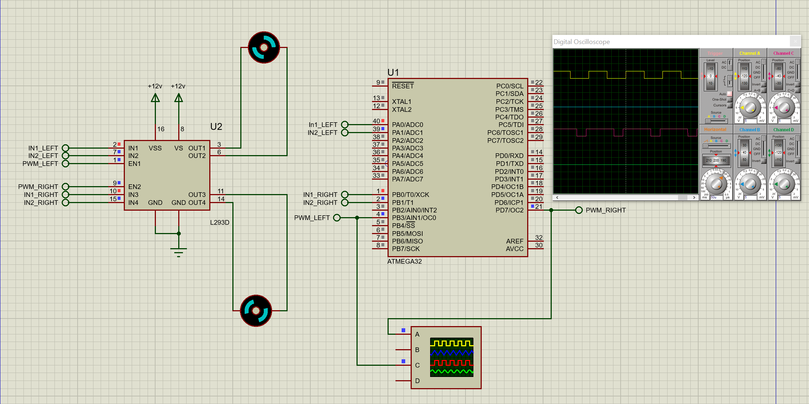

Motor driver
================

Introduction
------------
A Motor driver to control direction and speed by PWM on ATmega32 with the AVR toolchain .

Hardware
--------
* USB Type A to Type B cable
* AVR ATmega32 microcontroller.
* 2 DC Motors
* L293D driver Circuit

Circuit
--------

Installation
------------
You will need to have the AVR toolchain installed on your system. This includes:
* avr-gcc
* avr-libc
* avrdude
* proteus  (for simulation)

Support
------
Please feel free to contact me if you have any questions/concerns. My email address is hossam_elbahrawy@hotmail.com
